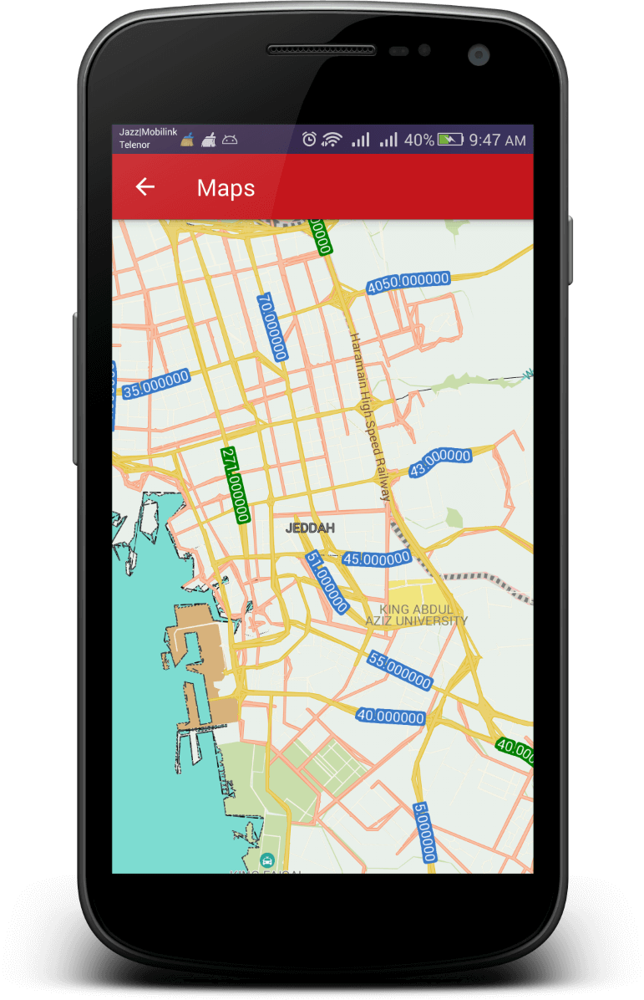
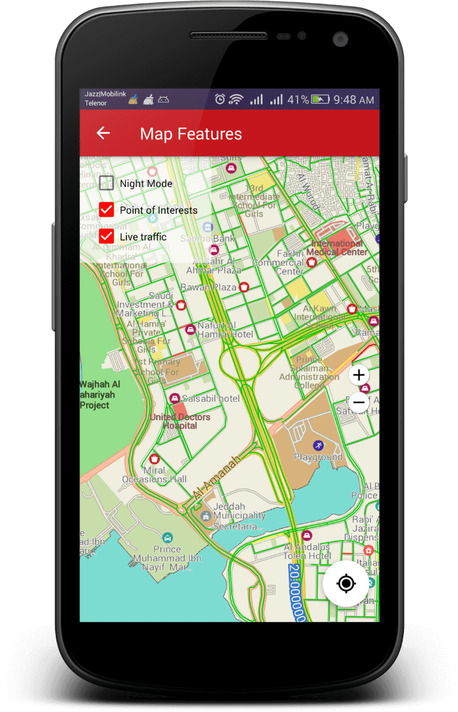
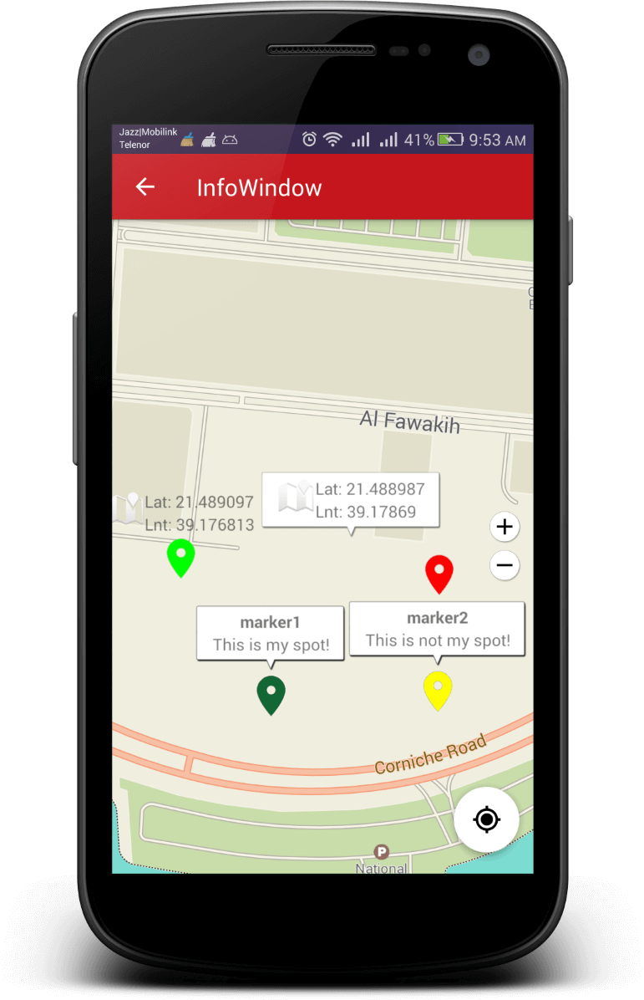
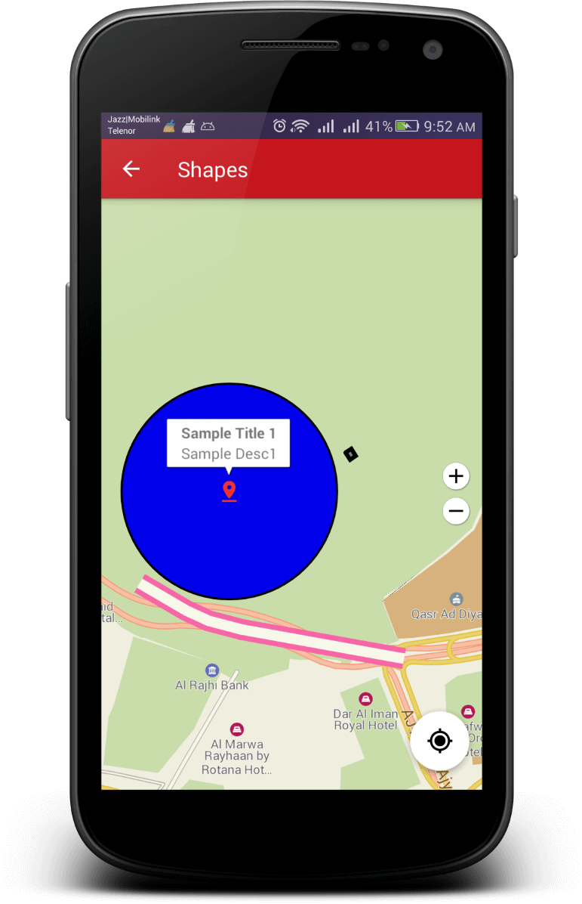
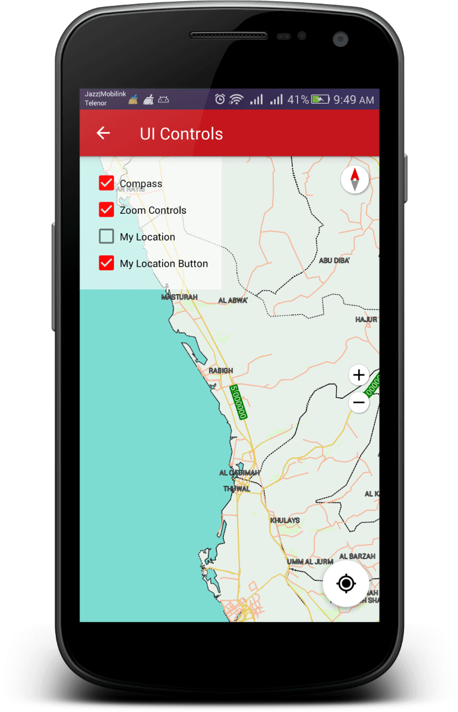
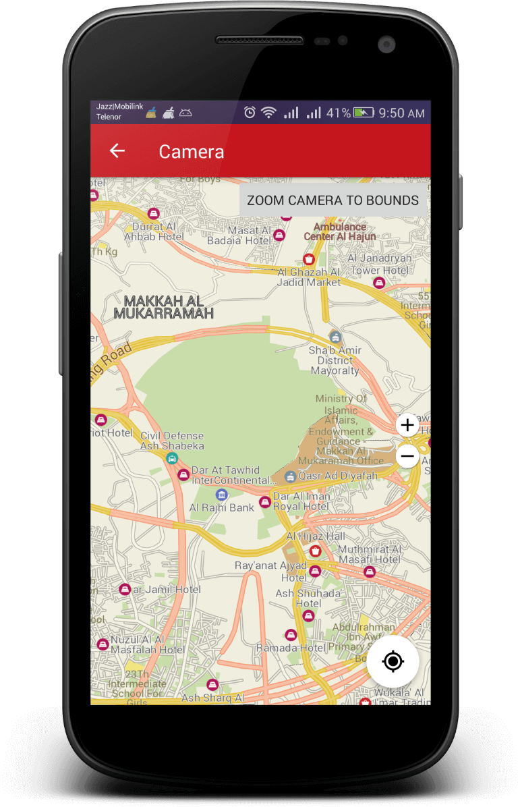
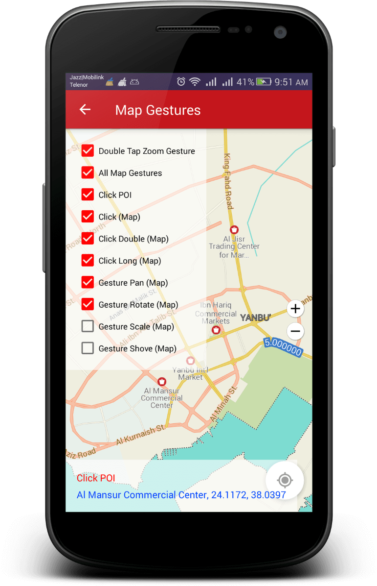
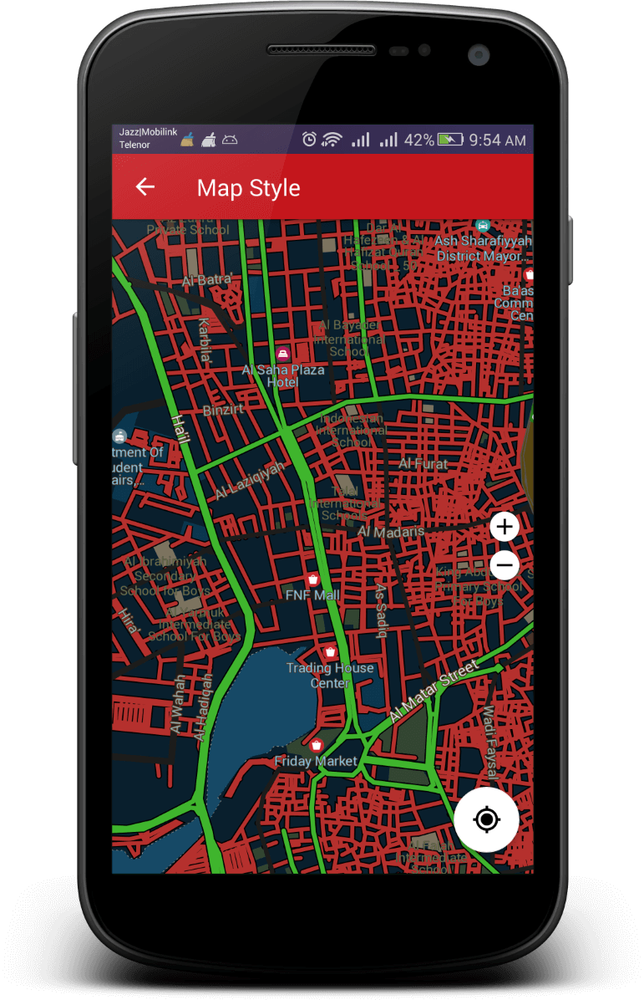
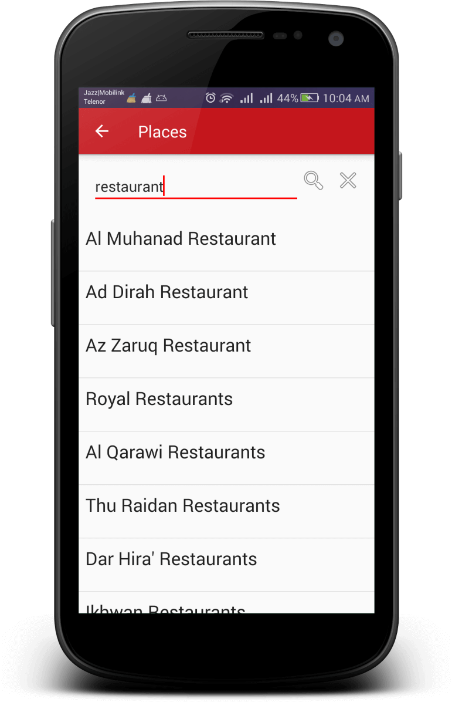
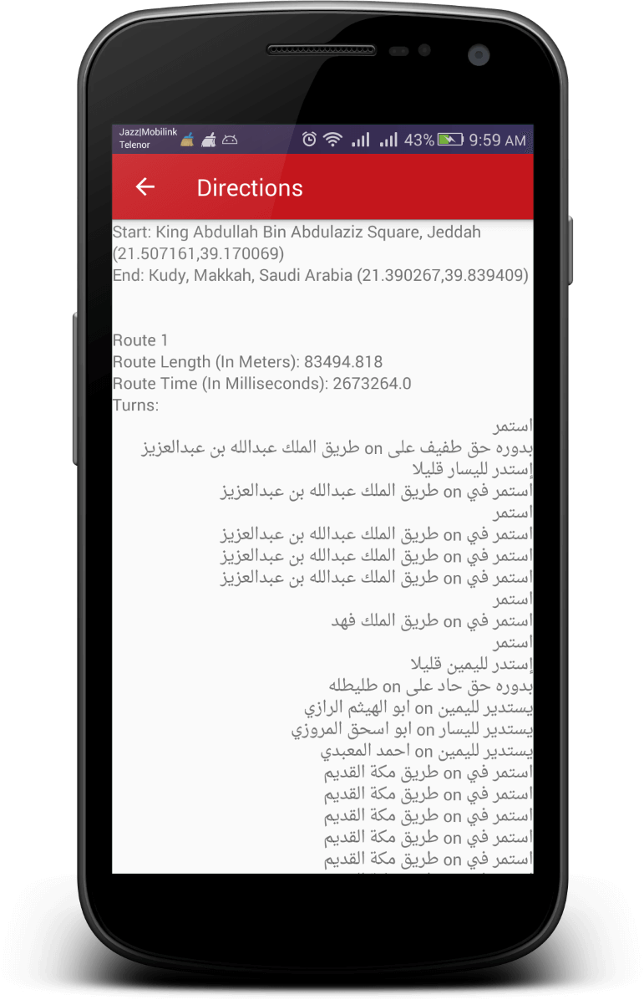

# FGT Maps Android SDK

## Overview
A Native Android SDK to integrate 3D Vector Maps, Places & Directions API in your Android Application Project.

> The project is tested on Android Studio versions 3.3, 3.3.1 & 3.4.2 - if you have issues building it, please upgrade to one of these versions.

## Content
- [Overview](https://github.com/farsi-geotech/fgt-maps-android-sdk-samples#overview) 
- [Features](https://github.com/farsi-geotech/fgt-maps-android-sdk-samples#features) 
- [Screenshot](https://github.com/farsi-geotech/fgt-maps-android-sdk-samples#screenshot) 
- [Sample APK](https://github.com/farsi-geotech/fgt-maps-android-sdk-samples#sample-apk) 
- [Developer Guide](https://github.com/farsi-geotech/fgt-maps-android-sdk-samples#developer-guide) 
- [API Documentation](https://github.com/farsi-geotech/fgt-maps-android-sdk-samples#api-documentation) 
- [Contributor](https://github.com/farsi-geotech/fgt-maps-android-sdk-samples#contributor) 
- [FAQs](https://github.com/farsi-geotech/fgt-maps-android-sdk-samples#faqs) 

## Features:
- [**Maps API**](/docs/Maps.md)
- [**Places API**](/docs/Places.md)
- [**Directions API**](/docs/Directions.md)

### Screenshot
**Maps**  

 
  
 
 
 
 
 
 

**Places**  

 

**Directions**  

 

### Sample APK
You can find sample debug APK [here](samples/build/outputs/apk/debug/samples-debug.apk)

### Contributor
Muhammad Hassan Jamil  (Assistant Manager Android Development - TPL Maps - hassan.jamil@tplmaps.com)

### Developer guide
You can find a brief developer guide [here] (Link)

## API Documentation
You can find API Documentation from [here](Link)
 
## [FAQs](/docs/FAQs.md)
